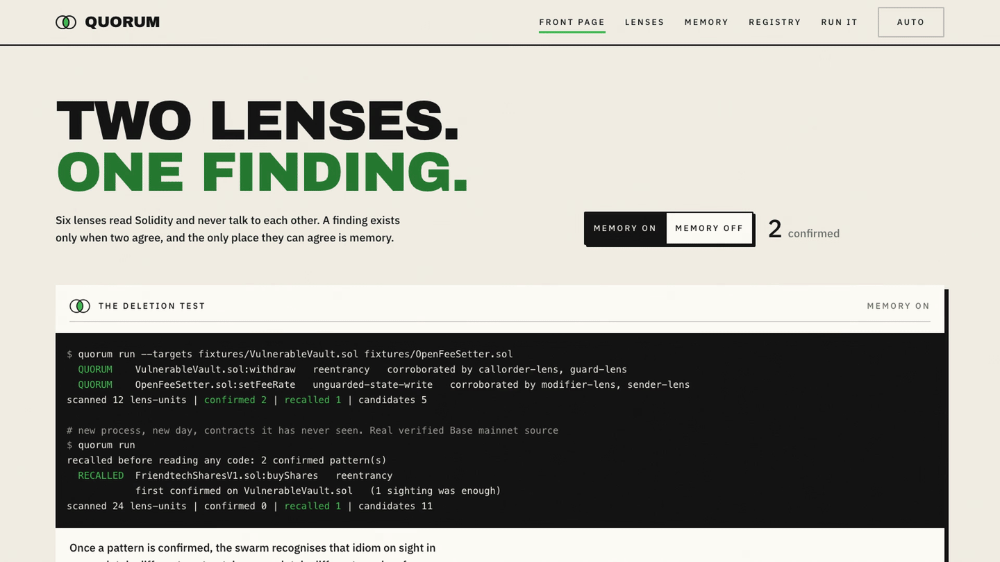
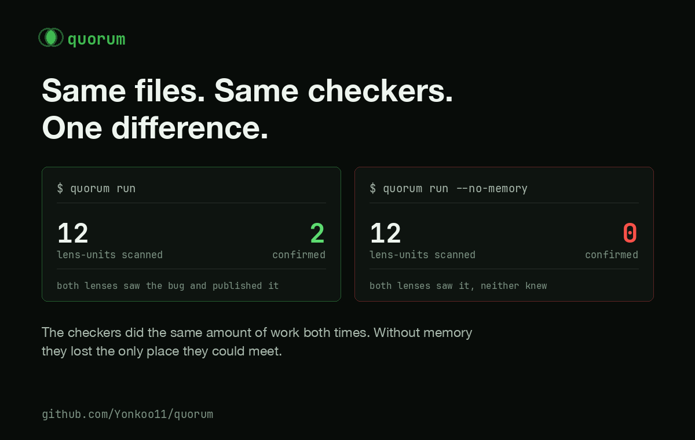
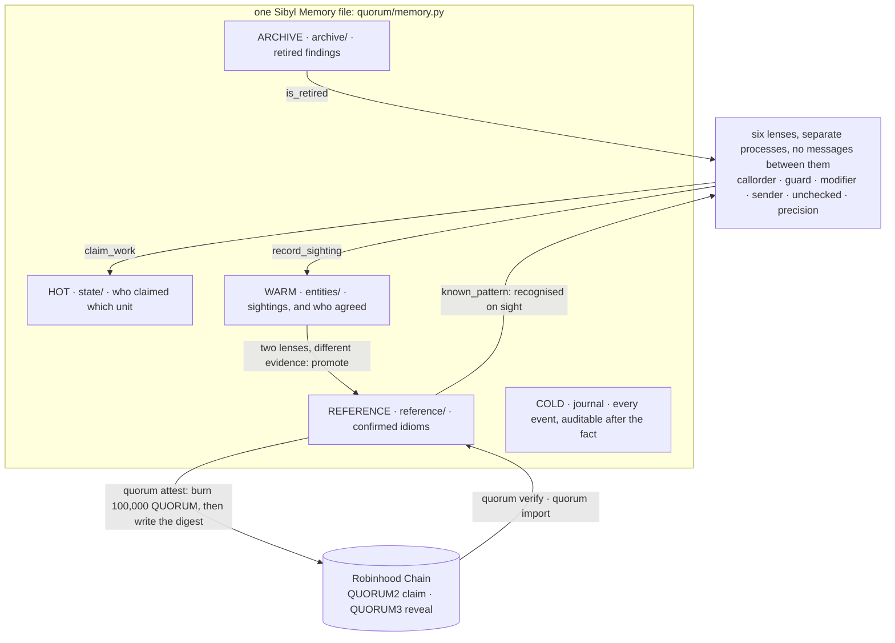

<div align="center">

# Quorum


[](https://github.com/Yonkoo11/quorum/actions/workflows/tests.yml)


[](https://runquorum.site)

### Two lenses. One finding.

**A swarm of security lenses that never talk to each other. Sibyl Memory is the only channel between them, and it is the only reason the swarm can agree on anything, recognise anything, or forget anything.**

Six independent lenses read Solidity source. No lens can publish a finding on its own. A finding becomes real only when two lenses that work from different evidence arrive at the same conclusion, and the count of who agreed lives in memory, not in any agent's head. Once a pattern is confirmed, the swarm recognises that idiom on sight in a completely different contract, in a completely different session, from a single sighting.

Delete the memory layer and there is no swarm left. Just six programs that each shout once and forget.

**[ Live site ↗ ](https://runquorum.site)** · **[ Watch the demo ↗ ](https://github.com/Yonkoo11/quorum/releases/download/v0.1.0/quorum-demo-v2.mp4)** · **[ Verify it yourself ↗ ](#verify-it-yourself-in-60-seconds)** · **[ The paid claim ↗ ](https://robinhoodchain.blockscout.com/tx/0xb999d218981ad9985b587da6c4017ae7dc8557ef702e27c9bbc9ca4f68bf1655)**

Built for the Sibyl Labs Hackathon.

</div>

---

## ▶ Demo



*The switch on [runquorum.site](https://runquorum.site), recorded live: flip the memory off and the same swarm on the same contracts confirms nothing.*

*Every terminal line in the demo is a real run: an empty memory, six lenses on two teaching contracts, two findings published and five held back, three processes sharing one memory and doing twenty-four units of work once each, the reentrancy idiom recognised inside Friend.tech's live contract from a single sighting, the same swarm with memory removed confirming nothing, and the first claim on Base verified against memory. The video predates the fee: the paid claim on Robinhood Chain is on the registry page, not in the video.*

**[quorum-demo-v2.mp4](https://github.com/Yonkoo11/quorum/releases/download/v0.1.0/quorum-demo-v2.mp4)** (release asset, 12 MB) · the demo is also live: [the deletion test switch on the front page](https://runquorum.site) and [the in-browser claim verifier](https://runquorum.site/registry/).

| Turn the memory off. It finds nothing. | Same files. Same checkers. One difference. | No burn. No memory. |
|---|---|---|
|  |  |  |

---

## Table of contents

- [The problem](#the-problem)
- [What Quorum is](#what-quorum-is)
- [Verify it yourself in 60 seconds](#verify-it-yourself-in-60-seconds)
- [The headline result](#the-headline-result)
- [Architecture](#architecture)
- [Where memory is load-bearing](#where-memory-is-load-bearing)
- [Coordination without a message bus](#coordination-without-a-message-bus)
- [Why a quorum](#why-a-quorum)
- [Claims on Robinhood Chain](#claims-on-robinhood-chain)
- [What's real, and what we deliberately did not claim](#whats-real-and-what-we-deliberately-did-not-claim)
- [Tech stack](#tech-stack)
- [Project layout](#project-layout)
- [Run it](#run-it)
- [Tests](#tests)
- [Site and docs](#site-and-docs)

---

## The problem

A single detector that reports everything it sees is noise. Six of them are six times the noise.

- **A lens on its own cannot tell a finding from a sighting.** Nobody checks whether a second, independent reading agrees.
- **Agents that share nothing duplicate everything.** Without a shared record of who claimed what, every process scans every unit.
- **Nothing learned survives the session.** A pattern confirmed today is re-derived from scratch tomorrow, on the same contract.
- **Human corrections evaporate.** Retire a false positive and the next run reports it again.

Every one of those is a memory problem, not a detection problem. Quorum is the coordination and memory layer; the lenses are the honest minimum needed to have something real to coordinate about.

## What Quorum is

Six regex-and-brace-matching lenses over Solidity source, coordinated through one Sibyl Memory file and nothing else. The loop:

<div align="center">

**`SCAN → CORROBORATE → REMEMBER → RECOGNISE → CLAIM → VERIFY`**

</div>

1. **Scan.** Six lenses read the source, two per risk, each pair reasoning from different evidence. A lens records what it saw and reads nothing about what its peers saw.
2. **Corroborate.** A finding becomes real only when two lenses that work from different evidence arrive at the same conclusion. The tally of who agreed lives on the finding in memory (WARM tier), not in any agent's head. Disagreement is kept as a candidate and never published.
3. **Remember.** A confirmed idiom is promoted to permanent swarm knowledge (REFERENCE tier). Every sighting, promotion, suppression and on-chain claim is appended to the COLD journal.
4. **Recognise.** In a later session, on a contract the swarm has never read, a confirmed idiom is matched on sight from a single sighting. No quorum needed the second time.
5. **Claim.** `quorum attest` burns the fee (100,000 QUORUM, destroyed, paid to nobody) and writes the claim digest to Robinhood Chain as a self-addressed 0-value transaction. The finding itself never leaves the machine.
6. **Verify.** `quorum verify` reads the claim back, checks the burn it points at is a real burn of at least the fee by the same signer, and recomputes the digest from memory. A claim whose fee was never burned does not verify.

## Verify it yourself in 60 seconds

No key, no wallet, no GPU. Every line below was run on a fresh memory file before it was written here; the expected results are in the comments.

```bash
git clone https://github.com/Yonkoo11/quorum && cd quorum
python3 -m venv .venv && .venv/bin/pip install -e .          # or: uv venv --python 3.12 .venv && uv pip install --python .venv/bin/python -e .

.venv/bin/python -m pytest tests -q                           # → 25 passed
.venv/bin/quorum --db fresh.db run --targets fixtures/*.sol   # → confirmed 2 | recalled 1 | candidates 5
.venv/bin/quorum --db fresh.db run --no-memory --targets fixtures/*.sol
                                                              # → confirmed 0 | recalled 0: without memory the swarm
                                                              #   cannot corroborate, recognise or forget.
.venv/bin/quorum --db fresh.db import 0x7556ec748f8ffb9e2ca5809c4383e407f4affb9b847124c0d33205281e905f32
                                                              # → ok digest matches the claim
                                                              #   ok revealed by the claim's signer
                                                              #   ok claim fee of 100,000 QUORUM burned
                                                              #   imported into REFERENCE
```

The import reads Robinhood Chain and refuses unless the revealed fields hash to the claim's digest, the reveal came from the claim's signer, and the claim's fee was burned. `quorum verify <tx>` on your machine checks the same chain half and then looks for the finding in *your* memory; on a fresh file it reports, honestly, that no finding there reproduces the digest, because the digest commits to the exact finding the publishing swarm held. The zero-install path is the [in-browser verifier](https://runquorum.site/registry/), which reads the transaction from a public node in your browser and compares it with the digest printed on the page.

---

## The headline result

```console
$ quorum run --targets fixtures/VulnerableVault.sol fixtures/OpenFeeSetter.sol
  QUORUM    VulnerableVault.sol:withdraw   reentrancy   corroborated by callorder-lens, guard-lens
  QUORUM    OpenFeeSetter.sol:setFeeRate   unguarded-state-write   corroborated by modifier-lens, sender-lens
scanned 12 lens-units | confirmed 2 | recalled 1 | candidates 5

# new process, new day, contracts it has never seen. Real verified Base mainnet source
$ quorum run
recalled before reading any code: 2 confirmed pattern(s)
  RECALLED  FriendtechSharesV1.sol:buyShares   reentrancy
            first confirmed on VulnerableVault.sol   (1 sighting was enough)
scanned 24 lens-units | confirmed 0 | recalled 1 | candidates 11

# same swarm, same contracts, memory removed
$ quorum run --no-memory
scanned 24 lens-units | confirmed 0 | recalled 0 | candidates 12
nothing was confirmed, recalled or suppressed: without memory the swarm
cannot corroborate, recognise or forget.
```

```console
$ quorum recall

confirmed patterns (REFERENCE tier)
  reentrancy             reentrancy:97d18d17cfa4494a
    first confirmed on VulnerableVault.sol by callorder-lens, guard-lens
    recognised since on FriendtechSharesV1.sol  (1 sighting each, no quorum needed)
```

The pattern was learned on a teaching fixture and recognised in production code deployed on Base. `msg.sender.call{value: amount}("")` and `protocolFeeDestination.call{value: protocolFee}("")` are the same idiom, so they hash to the same signature. `weth.deposit{value: amountETH}()` is a different idiom and does not.

Run Quorum against audited production contracts and it mostly holds its tongue. On Aerodrome's Router, WETH9 and a Compound proxy it confirms nothing and files eleven candidates. That is the intended behaviour, not a failure to find bugs.

---

## Architecture



Every Sibyl Memory read and write in this project is in one file, [`quorum/memory.py`](quorum/memory.py). The chain layer, [`quorum/chain.py`](quorum/chain.py), is the only module that knows the token exists; [`tests/test_token.py`](tests/test_token.py) asserts that the scanner modules never touch it.

## Where memory is load-bearing

Four call sites carry the whole product.

| What breaks without it | Written at | Read at | Tier |
|---|---|---|---|
| **Agents duplicate each other's work.** A lens claims a (contract, lens) unit; a peer that finds it claimed does not scan it. This is the only coordination mechanism in the system. | [`claim_work`](quorum/memory.py#L91) | same call | HOT `state/` |
| **Quorum can never be reached.** Corroboration is accumulated across lenses, processes and sessions on the finding entity. A lens has no idea who else agreed with it; memory does. | [`record_sighting`](quorum/memory.py#L112) | [`swarm.py:74`](quorum/swarm.py#L74) | WARM `entities/` |
| **Nothing is ever recognised again.** A confirmed idiom becomes permanent swarm knowledge and is matched on sight in later sessions, on contracts the swarm has never read. | [`promote`](quorum/memory.py#L152) | [`known_pattern`](quorum/memory.py#L181) → [`swarm.py:79`](quorum/swarm.py#L79) | REFERENCE `reference/` |
| **Human corrections evaporate.** Retire a finding once and no later session reports that shape again. | [`retire`](quorum/memory.py#L196) | [`is_retired`](quorum/memory.py#L209) → [`swarm.py:64`](quorum/swarm.py#L64) | ARCHIVE `archive/` |

Every sighting, promotion, suppression and on-chain claim is also appended to the COLD journal ([`log`](quorum/memory.py#L144)), which is what makes a published claim auditable after the fact.

### The deletion test, as a command

The rules ask what happens if you delete the memory layer. Rather than assert an answer, Quorum ships it as a runtime flag. [`NoMemory`](quorum/memory.py#L225) implements the identical interface and forgets everything the instant it is written:

```console
$ quorum run --no-memory
```

Every claim succeeds, so agents duplicate work. Every sighting looks like the first, so corroboration never accumulates and quorum is never reached. Nothing is recognised from an earlier session. Retirements do not stick. Confirmed findings: **0**. Recalled: **0**. The core function is gone, and the same behaviour is asserted in [`tests/test_quorum.py`](tests/test_quorum.py).

---

## Coordination without a message bus

Quorum's agents are separate operating-system processes. They share one memory
file and nothing else: no queue, no broker, no RPC between them.

```console
$ quorum swarm --workers 3

3 agent processes, one memory, no message bus
  agent-1   scanned   9  stood down on  15 units a peer had already claimed
  agent-2   scanned   7  stood down on  17 units a peer had already claimed
  agent-3   scanned   8  stood down on  16 units a peer had already claimed

  24 units scanned in total, 48 skipped, in 0.7s
  no agent sent a message to any other agent. The HOT tier decided who did what.
```

Three processes, twenty-four units of work, each done exactly once. Claiming is
optimistic because a read-then-write across processes is not atomic: an agent
writes its own id into the claim, waits out the window in which a peer could be
writing too, then reads the claim back and stands down unless it sees itself
([`claim_work`](quorum/memory.py#L110)). Take the HOT tier away and all three
agents do all twenty-four units.

## Why a quorum

Quorum pairs its lenses two per risk, and each pair reasons from different evidence:

| Risk | Lens A | Lens B |
|---|---|---|
| `reentrancy` | `callorder-lens`: an external call precedes a state write in the same function | `guard-lens`: the function moves value out and carries no reentrancy guard |
| `unguarded-state-write` | `modifier-lens`: externally callable, writes storage, carries no modifier at all | `sender-lens`: writes a privileged-looking variable with no `msg.sender` check anywhere on the path |
| `unsafe-math` | `unchecked-lens`: arithmetic inside an `unchecked` block | `precision-lens`: a division evaluated before a multiplication |

Agreement is signal. Disagreement is kept as a candidate and never published.

---

## Claims on Robinhood Chain

When a finding reaches quorum it stops being a private opinion. `quorum attest` writes the claim digest to Robinhood Chain as a self-addressed 0-value transaction. The first claim was written to Base before the token existed, with `QUORUM1`-prefixed calldata:

```console
$ quorum attest
signer 0xf9946775891a24462cD4ec885d0D4E2675C84355  balance 0.000500 ETH
  claimed on Base FriendtechSharesV1.sol:buyShares:reentrancy
    https://basescan.org/tx/0xa648821d91093df770b72c60be56834d069c9355c785e6195183e911f00bf713
```

A live claim, block 51138878. It can be read back and checked against the evidence that produced it:

```console
$ quorum verify 0xa648821d91093df770b72c60be56834d069c9355c785e6195183e911f00bf713

claim on Base  block 51138878  2026-09-10T19:05:03+00:00
  published by 0xf9946775891a24462cD4ec885d0D4E2675C84355
  digest       0xfd7d5ec6e350aa28f160c2d3cf60d3faf4b52d8f7280bfe9f665ce1809042721

  the evidence for this claim is still in memory
    FriendtechSharesV1.sol:buyShares:reentrancy
    corroborated by guard-lens  (recall)
  digest recomputed from memory matches the chain
```

The digest commits to the risk, the idiom signature, the contract, the function and the exact set of lenses that corroborated it ([`chain.py`](quorum/chain.py)). The finding itself never leaves the machine. Sibyl Memory is local-first and so is this. What goes on chain is a timestamped, verifiable claim that *this swarm knew this shape at this block*, which is what a disclosure timeline actually needs. The transaction hash is written back onto the finding entity in memory, so the claim and its evidence stay joined.

The signing key is read from the process environment at call time. It is never logged, printed or written to disk.

### Publishing costs. Scanning does not.

The claims above form a public registry of "this swarm knew this bug shape at this block". A public registry that is free to write to fills with junk, so writing to it has a cost, and the cost is destroyed rather than paid to anyone: each claim burns **100,000 QUORUM** through the token contract's own `burn(uint256)` on Robinhood Chain before the claim is written to the same chain, and the claim's calldata (`QUORUM2` shape) carries the burn's transaction hash. `quorum verify` checks both halves: the digest on chain, and that the burn it points at is a real burn of at least the fee by the same signer. Burn and claim share one chain, so one RPC verifies both. A claim whose fee was never burned does not verify.

The first claim at the current fee, 2026-09-12. (The launch claim at the 1,000 fee, claim `0xacd123…efb0` at block 60748972 with burn `0x76da2f…d5d7`, came 22 minutes earlier and still verifies.)

```console
$ quorum attest --limit 1
signer 0xf994...4355  0.002358 ETH on Robinhood Chain  100,830 QUORUM on Robinhood Chain
each claim burns 100,000 QUORUM before it is written. Scanning is free; publishing is not.
  burned 100,000 QUORUM
    https://robinhoodchain.blockscout.com/tx/0x2005d3b84a3286980ff134d0641d120e7859e13568abf003e393300ac3c9b34a
  claimed on Robinhood Chain FriendtechSharesV1.sol:buyShares:reentrancy
    https://robinhoodchain.blockscout.com/tx/0xb999d218981ad9985b587da6c4017ae7dc8557ef702e27c9bbc9ca4f68bf1655

$ quorum verify 0xb999d218981ad9985b587da6c4017ae7dc8557ef702e27c9bbc9ca4f68bf1655
claim on Robinhood Chain  block 60762176  2026-09-12T02:46:55+00:00
  published by 0xf9946775891a24462cD4ec885d0D4E2675C84355
  digest       0xfd7d5ec6e350aa28f160c2d3cf60d3faf4b52d8f7280bfe9f665ce1809042721
  fee burned   100,000 QUORUM on Robinhood Chain, block 60762150, by the same signer
  ...
  digest recomputed from memory matches the chain
```

The burn is saved to memory the moment it lands, before the claim is sent, so if the claim transaction fails the next `quorum attest` reuses that burn instead of paying a second fee.

Once a claim is paid, its owner can **reveal** the pattern behind it, and any other swarm can **import** it. Run live the same day, the import into a memory database that had never seen anything:

```console
$ quorum reveal FriendtechSharesV1.sol:buyShares:reentrancy      # discloses the claimed fields on chain (QUORUM3)
  revealed on Robinhood Chain FriendtechSharesV1.sol:buyShares:reentrancy
    https://robinhoodchain.blockscout.com/tx/0x7556ec748f8ffb9e2ca5809c4383e407f4affb9b847124c0d33205281e905f32

$ quorum --db fresh.db import 0x7556ec748f8ffb9e2ca5809c4383e407f4affb9b847124c0d33205281e905f32   # someone else's machine
reveal reentrancy  reentrancy:97d18d17cfa4494a  by 0xf9946775891a24462cD4ec885d0D4E2675C84355
  ok  digest matches the claim
  ok  revealed by the claim's signer
  ok  claim fee of 100,000 QUORUM burned
  imported into REFERENCE: the swarm will recognise this idiom on sight
```

An import checks three things and refuses if any fails: the revealed fields hash to the claim's digest, the reveal came from the claim's signer, and the claim's fee was burned. So a pattern nobody paid to publish never enters anyone's memory. That is the whole job of the token: it is the cost of being listened to by other people's swarms. Everything else, `run`, `swarm`, `recall`, `retire`, the memory tiers, the `--no-memory` test, has no token in it, and [`tests/test_token.py`](tests/test_token.py) asserts that the scanner modules never touch it.

Token: `QUORUM` on Robinhood Chain (chain id 4663), contract [`0xa6452Fd7134218f62056a304eaf501F8714A26b9`](https://robinhoodchain.blockscout.com/address/0xa6452Fd7134218f62056a304eaf501F8714A26b9). The first claim (Base, block 51138878) predates the fee and the move to Robinhood Chain; the first paid claim is the one above; `quorum verify` looks on Robinhood Chain first, then Base, and reads it back as a v1 claim with no burn to check. `QUORUM_CHAIN_ID` can point new claims at any chain in `chain.CHAINS`; the fee burn is always on Robinhood Chain, where the token is. The fee was 1,000 QUORUM at launch and is 100,000 from Robinhood Chain block 60761164 (`chain.FEE_SCHEDULE`); a burn is judged against the fee in force at its own block, so claims paid at the launch rate keep verifying.

---

## What's real, and what we deliberately did not claim

| Capability | Status |
|---|---|
| **The deletion test** | Real, and a runtime flag, not a paragraph. `--no-memory` runs the identical swarm through [`NoMemory`](quorum/memory.py#L225): confirmed 0, recalled 0, asserted in [`tests/test_quorum.py`](tests/test_quorum.py). |
| **Cross-session recognition** | Real. Learned on a teaching fixture, recognised in verified Base mainnet source in a new process from one sighting. The signature hashes the idiom on a line, not the identifiers on it. |
| **Coordination without a message bus** | Real. Three OS processes, one memory file, 24 units each done exactly once; the HOT tier decided who did what. Take it away and all three do all 24. |
| **Paid claims on chain** | Real. Fee burned through the token's own `burn(uint256)`, claim written with the burn hash in its calldata, both live on Robinhood Chain (block 60762176). Reveal and import ran live the same day. |
| **Measured against labelled bugs** | [`bench/BENCHMARK.md`](bench/BENCHMARK.md), run 2026-09-12 on SmartBugs-curated (143 files). Reentrancy: the lenses alone find 94% of the labelled functions at 14% precision; the two-witness rule turns that into 39% precision at 68% recall. Access control 5% recall, arithmetic 0%: those lenses look for modern shapes (`unchecked` blocks, missing modifiers) that this 0.4-era corpus does not contain. The first run scored 1% overall; two idiom fixes to the lenses (`.call.value()`, implicit `public`) took it to 31%, and they were made on this corpus, so treat the number as tuned until a held-out run exists. [`bench/README.md`](bench/README.md) has the history. |
| **Restraint on production code** | Measured, not asserted. On Aerodrome's Router, WETH9 and a Compound proxy: 0 confirmed, 11 candidates held back. |
| **Tests** | 25, run in CI on every push. They cover the idiom signature matching across contracts, that one lens never confirms, that two lenses reach quorum, that the deletion test really confirms nothing, the claim and reveal calldata shapes, that a burn is only valid for the fee on the token, that `attest` burns before it claims, that the scanner modules never touch the token, that burn and claim share one chain by default, and that the first Base claim still reads after the move, and that the pre-0.5 call idiom reaches quorum. |
| The lenses | Deliberately simple: regex-and-brace-matching heuristics over source text, not a compiler front end. They cannot follow a storage alias (`var acc = Acc[msg.sender]; acc.balance -= x`), which is the largest remaining reentrancy miss in the benchmark. The point of this project is the coordination and memory layer. |
| Vulnerability claims | **None.** Quorum publishes *corroborated idioms worth review*, not confirmed vulnerabilities. A quorum means two independent lenses agreed on a shape, nothing more. The Friend.tech recall above is a pattern match on a call idiom, not an allegation about that contract. |
| The fixtures | [`fixtures/`](fixtures/) are vulnerable on purpose and are not deployed anywhere. |
| The first claim | On Base, block 51138878, before the fee and the move. It reads back as a v1 claim with no burn to check. |
| Exploits, proofs of concept, severity | Not claimed, anywhere in this repository. |

---

## Tech stack

- **Language:** Python 3.10 to 3.13. No framework; the CLI is `argparse`.
- **Memory:** [Sibyl Memory](https://github.com/Sibyl-Labs/Sibyl-Memory), all five tiers, load-bearing. Every read and write in one file.
- **Chain:** `web3.py` against Robinhood Chain (chain id 4663) for the token, the fee burn, claims, reveals and imports; Base mainnet for the first claim and for verified target source via Blockscout (no API key needed).
- **Tests:** pytest, 25 tests, no chain access needed (the chain is mocked where it matters).
- **Site:** static HTML, CSS and JavaScript in [`docs/`](docs/), served by GitHub Pages at [runquorum.site](https://runquorum.site); the in-browser verifier reads the chain through public JSON-RPC nodes.
- **Demo:** the terminal recording lives in [`demo/`](demo/) and the video assembly in [`video/`](video/).

## Project layout

```
quorum/
  agents.py      # the six lenses, two per risk
  swarm.py       # the run: claim units, record sightings, promote, recall, retire
  memory.py      # every Sibyl Memory read and write (HOT, WARM, REFERENCE, ARCHIVE, COLD) and NoMemory
  chain.py       # claim digest, QUORUM1/2/3 calldata, fee schedule, burn check, attest, verify, reveal, import
  targets.py     # quorum fetch: verified source from Blockscout
  cli.py         # the command line
tests/           # 25 tests: test_quorum.py (the swarm) and test_token.py (the token boundary)
fixtures/        # two teaching contracts, vulnerable on purpose
docs/            # the site (runquorum.site): five pages, one stylesheet, one script, self-hosted fonts
brand/           # the cards, marks and fonts the site and the posts are built from
bench/           # the benchmark runner and its numbers, re-run with one command
demo/            # the recorded terminal session and its beats
video/           # the demo video pipeline
```

## Run it

Python 3.10 to 3.13. If `python3 -m venv` fails on your machine, the `uv` path below avoids it entirely.

```bash
git clone https://github.com/Yonkoo11/quorum && cd quorum

python3 -m venv .venv && .venv/bin/pip install -e .   # or:
uv venv --python 3.12 .venv && uv pip install --python .venv/bin/python -e .

# pull real verified source from Base mainnet (no API key needed)
.venv/bin/quorum fetch 0xCF205808Ed36593aa40a44F10c7f7C2F67d4A4d4 \
                       0xcF77a3Ba9A5CA399B7c97c74d54e5b1Beb874E43 \
                       0x4200000000000000000000000000000000000006

.venv/bin/quorum run --targets fixtures/*.sol   # the swarm learns
.venv/bin/quorum run                            # a fresh session recognises
.venv/bin/quorum recall                         # what it knows, and how it knows it
.venv/bin/quorum swarm --workers 3              # three processes, one memory
.venv/bin/quorum verify <tx>                    # check a claim against memory
.venv/bin/quorum recall --since 2026-09-10T00:00:00+00:00   # what it learned since
.venv/bin/quorum run --no-memory                # the deletion test
.venv/bin/python -m pytest tests -q             # 25 tests
```

`quorum attest` additionally needs `DEPLOYER_PRIVATE_KEY` in the environment, gas on Robinhood Chain, and the claim fee in QUORUM. `QUORUM_RPC` overrides the public Robinhood Chain endpoint; `BASE_RPC` overrides the public Base endpoint used only to read the first claim.

Commands: `fetch`, `run`, `swarm`, `recall [--since]`, `retire <key> --reason`, `attest`, `verify <tx>`, `reveal <key>`, `import <tx>`, `status`.

## Tests

```bash
.venv/bin/python -m pytest tests -q             # 25 passed
```

[`tests/test_quorum.py`](tests/test_quorum.py) drives the swarm end to end on the fixtures: one lens never confirms, two lenses from different evidence do, the signature matches across contracts, the deletion test confirms nothing, a retirement sticks. [`tests/test_token.py`](tests/test_token.py) pins the calldata shapes, the digest a reveal must reproduce, the burn rules a claim must satisfy, that `attest` burns before it claims and reuses a saved burn rather than paying twice, that the scanner modules never import the chain, and that the first Base claim still reads after the move to Robinhood Chain. The same suite runs in [CI](https://github.com/Yonkoo11/quorum/actions/workflows/tests.yml) on every push.

## Site and docs

[runquorum.site](https://runquorum.site) · [The lenses](https://runquorum.site/lenses/) · [The memory](https://runquorum.site/memory/) · [The registry, with the in-browser verifier](https://runquorum.site/registry/) · [Run it](https://runquorum.site/start/)

MIT licensed. Memory is a local file; nothing is uploaded.
